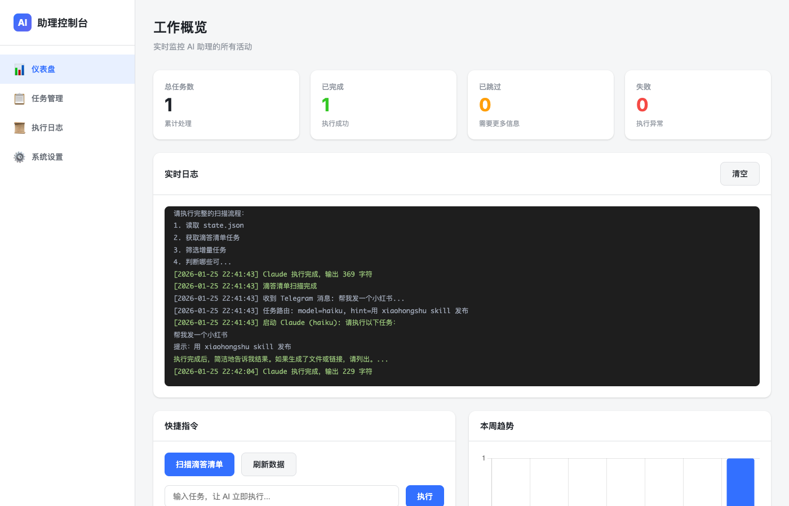

# Personal AI Company

**一家全员 AI 的公司，你是唯一的人类——CEO**

---

## 一、全员 AI，只有老板是人

你拥有一家公司。

公司里没有人类员工，所有部门都由 AI 驱动：

```
┌─────────────────────────────────────────────────────────────────┐
│                    YOUR PERSONAL AI COMPANY                      │
├─────────────────────────────────────────────────────────────────┤
│                                                                  │
│  👤 CEO (你，人类)                                               │
│   │                                                              │
│   └─→ 🤖 CEO 助理 (有状态，永久驻留)                              │
│        │                                                         │
│        ├─→ 📢🎬 内容与公关部：素材收集→内容创作→提交审批           │
│        ├─→ 🔬 战投部：行业调研、竞品分析、投资研报                 │
│        ├─→ 🕵️ 情报分析部：线索追踪、内容提取、深度分析            │
│        ├─→ 📊 运营部：数据监控、任务管理、流程自动化               │
│        │                                                         │
│        └─→ 🏢 事业部：从 0 到 1 打造产品                          │
│             ├─→ 📦 产品部：痛点挖掘、需求分析                     │
│             └─→ 💻 研发部：写代码、Supabase、发布应用             │
│                                                                  │
│     全员 AI，7×24 在线，永不请假，随叫随到                        │
│                                                                  │
└─────────────────────────────────────────────────────────────────┘
```

**你的工作方式变了**：

| 传统模式 | AI 公司模式 |
|---------|------------|
| 自己写推文 | 下达指令："发一条关于 AI 趋势的推" |
| 自己做调研 | 下达指令："调研一下 AI 视频赛道" |
| 自己剪视频 | 下达指令："把这个素材做成短视频" |
| 自己追踪线索 | 下达指令："扒一扒这个公司" |
| 凡事亲力亲为 | **只做决策，执行交给 AI** |

---

## 二、公司组织架构

### 2.1 层级关系

```
👤 CEO (你，人类) ← 最终决策者
 │
 │  下达指令 / 审批发布
 │
 ▼
🤖 CEO 助理 (有状态，永久驻留) ← 调度者
 │
 │  调度各部门 / 汇报结果
 │
 ▼
各部门 (无状态，临时拉起) ← 执行者
```

### 2.2 部门职责

| 部门 | 模型 | 职责 | 挂载 Skills |
|-----|------|------|-------------|
| 🤖 **CEO 助理** | sonnet | 调度各部门、汇报结果 | `personal-assistant`, `chat2CEO` |
| 📢🎬 **内容与公关部** | sonnet | 素材收集→内容创作→发布 | `social-media-download`, `social-media-publish`, `nanobanana-draw`, `remove-bg` |
| 🔬 **战投部** | opus | 行业调研、竞品分析、持仓分析 | `research-by-reddit`, `futu-trades`, `KOL-info-collect` |
| 🕵️ **情报分析部** | sonnet | 线索追踪、内容提取、深度分析 | `social-media-download` |
| 📊 **运营部** | haiku/opus | 数据监控、任务管理、每日复盘 | `daily-review`, `dida365-pomodoro`, `dida-auto-worker` |
| 🏢 **AI 事业部** | sonnet | 从 0 到 1 打造 AI 产品 | `ui-ux-pro-max` |
| ├─ 📦 产品部 | opus | 痛点挖掘、需求分析 | `pain-point-research`, `research-by-reddit` |
| └─ 💻 研发部 | sonnet | 写代码、部署上线 | `eas-testflight` |

### 2.3 通用能力 (所有部门可用)

| Skill | 用途 |
|-------|------|
| `perplexity-research` | 深度调研 |
| `openrouter-chat` | 多模型调用 |
| `pdf2markdown` | PDF 转 Markdown |
| `volcengine-asr` | 语音转文字 |
| `volc-tts` | 文字转语音 |

### 2.4 权限限制

| 能力 | 限制 |
|------|------|
| `chat2CEO` (Telegram 通信) | **仅 CEO 助理可用**，其他 Agent 禁止 |

### 2.5 审批机制

**内容与公关部没有独立发布权限**，必须提交草稿给 CEO 审批：

```
内容与公关部创作内容
        │
        ▼
   📝 提交草稿
        │
        ▼
  CEO 助理呈报给 CEO
        │
        ▼
   CEO（你）审阅
        │
   ┌────┴────┐
   ▼         ▼
 「发」    「改 xxx」
   │         │
   ▼         ▼
CEO 助理    返回修改
执行发布
```

---

## 三、公司运营模式

### 3.1 模式一：即时指令

CEO 随时可以下达命令，CEO 助理调度对应部门执行。

```
你（Telegram）：发条推，内容是"Claude Code 真好用"
CEO 助理：收到，已交给内容与公关部...
CEO 助理：📝 草稿已准备好，请审阅：

---
**目标平台**：X
**正文**：Claude Code 真好用...

回复「发」批准发布，「改 xxx」修改
---

你：发
CEO 助理：✅ 已发布 https://x.com/...
```

### 3.2 模式二：自动巡检

每 30 分钟，CEO 助理自动检查"CEO 待办清单"（滴答清单），调度各部门执行：

```
CEO 助理：老板，各部门汇报：

    📢🎬 内容与公关部：
    📝 待审批 1 项：
    - 推文草稿：今天学到的 3 个技巧

    🕵️ 情报分析部完成 1 项：
    ✅ 分析报告：xxx 公司背景调查

    ⏭️ 跳过 1 项（需要更多信息）：
    - "洗稿发小红书" → 洗哪篇内容？
```

### 3.3 模式三：每日复盘 (Daily Review)

每晚 **23:00**，运营部自动执行深度复盘：

```
运营部：📊 今日复盘完成

2026-01-26

> 今天主要在优化 AI 公司基础设施，托福学习时间偏少

🎯 OKR 进展:
- O6 智能化: 65% ████████░░ (Supabase + Agent 开发)
- O7 托福: 15% ██░░░░░░░░ (仅碎片阅读)
- ⚠️ 无归属: 20%

💡 关键洞察:
1. 技术债优先：连续 3 天在做基础设施，托福被挤压
2. 深度时间不足：今天深度阅读 < 30 分钟

📝 明日建议:
- 上午固定 1h 托福听力，不被打断

详细报告已写入 Notion
```

**数据来源**：
- Supabase: `browsing_records`, `agent_sessions`
- 本地: `~/odyssey` 第二大脑（OKR、进行中项目）

**分析维度**：
- OKR 对齐度：今天的活动贡献了哪个目标？
- 时间分配：深度工作 vs 碎片浏览
- 趋势预警：和昨天/上周对比

---

## 四、公司总部 Dashboard

访问 **http://localhost:5050** 进入公司管理后台。



**管理功能**：
- 📊 **经营数据** - 任务完成数、成功率、本周趋势
- 📜 **实时动态** - 各部门正在做什么（WebSocket 实时推送）
- 📋 **执行记录** - 所有已完成任务的状态和结果
- 🎯 **CEO 直通车** - 在网页直接下达指令

---

## 五、系统架构

### 5.1 有状态 vs 无状态

**整个公司只有一个有状态服务——CEO 助理**，其他都是无状态的临时工。

```
┌─────────────────────────────────────────────────────────────────┐
│                    CEO 助理 (有状态服务)                          │
│                                                                  │
│  Agent: ceo-assistant                                            │
│  Session: 永久保持                                                │
│  存储: ~/.claude/projects/.../xxx.jsonl                          │
│                                                                  │
│  特点：                                                          │
│  - 永久上下文，记得所有对话历史                                    │
│  - 了解老板的偏好、习惯、之前做过的事                              │
│  - 所有入口（Web/Telegram/定时）都是同一个"人"在响应               │
├─────────────────────────────────────────────────────────────────┤
│                         入口层                                    │
│                                                                  │
│  [Web Dashboard]  →  /api/chat  ─┐                               │
│  [Telegram 消息]  →  scheduler  ─┼──→ 同一个 CEO 助理 Session     │
│  [定时扫描]       →  scheduler  ─┘                               │
├─────────────────────────────────────────────────────────────────┤
│                      执行层 (无状态)                              │
│                                                                  │
│  CEO 助理通过 Task 工具临时拉起子 Agent：                          │
│                                                                  │
│  ├─ 内容与公关部 (sonnet): 创作内容 → 执行完即销毁                 │
│  ├─ 情报分析部 (sonnet): 线索追踪 → 执行完即销毁                   │
│  ├─ 战投部 (opus): 深度调研 → 执行完即销毁                        │
│  ├─ 运营部 (haiku): 数据查询 → 执行完即销毁                       │
│  └─ 事业部 (sonnet): 统筹产品和研发 → 执行完即销毁                 │
│       ├─ 产品部 (opus): 痛点调研 → 执行完即销毁                   │
│       └─ 研发部 (sonnet): 写代码 → 执行完即销毁                   │
│                                                                  │
└─────────────────────────────────────────────────────────────────┘
```

### 5.2 调度代码示例

CEO 助理通过 `Task` 工具拉起各部门：

```python
# CEO 助理调度内容与公关部
Task(
  subagent_type: "general-purpose",
  model: "sonnet",
  prompt: """
  你是内容与公关部的员工。
  请阅读部门职责：~/.claude/agents/departments/content-pr-department.md

  任务：老板想发一条关于 AI 的推文

  注意：你没有发布权限，只能准备草稿提交审批
  """
)

# CEO 助理调度事业部（二级调度）
Task(
  subagent_type: "general-purpose",
  model: "sonnet",
  prompt: """
  你是事业部的负责人。
  请阅读部门职责：~/.claude/agents/departments/business-unit.md

  任务：老板想做一个 AI 写作助手

  你需要先调度产品部做调研，再调度研发部做开发
  """
)
```

### 5.3 为什么这样设计？

| 设计 | 原因 |
|------|------|
| **CEO 助理有状态** | 你和助理是长期关系，它需要记得之前的对话、你的偏好 |
| **各部门无状态** | 具体任务不需要记忆，执行完就结束，省钱省资源 |
| **单一 Session** | 无论从哪个入口（Web/Telegram/定时），都是同一个"人"在响应 |
| **审批机制** | 发布权在 CEO 手里，避免 AI 自作主张 |

---

## 六、公司目录结构

```
~/.claude/
├── agents/
│   ├── ceo-assistant.md          # CEO 助理定义
│   ├── drafts/                   # 待审批草稿
│   └── departments/              # 各部门定义
│       ├── content-pr-department.md   # 内容与公关部
│       ├── research-department.md     # 战投部
│       ├── intelligence-department.md # 情报分析部
│       ├── ops-department.md          # 运营部
│       ├── business-unit.md           # 事业部
│       ├── product-department.md      # 产品部
│       └── dev-department.md          # 研发部
│
├── skills/personal-assistant/
│   ├── state.json            # 已处理任务记录
│   ├── scripts/
│   │   ├── scheduler.py      # 总调度中心
│   │   └── dashboard.py      # 公司管理后台
│   └── logs/                 # 运营日志
│
├── services/personal-assistant/
│   ├── run_scheduler.sh      # 调度中心启动脚本
│   └── run_dashboard.sh      # 管理后台启动脚本
│
~/Library/LaunchAgents/
├── com.claude.personal-ai-agent.plist      # 调度中心服务
└── com.claude.personal-ai-dashboard.plist  # 管理后台服务
```

---

## 七、搭建你的 AI 公司

### 7.1 公司基础设施

| 你需要准备的 | 公司类比 | 作用 |
|-------------|---------|------|
| **Mac 电脑** | 办公大楼 | 公司 7×24 运转的物理载体 |
| **[Amphetamine](https://apps.apple.com/app/amphetamine/id937984704)** | 大楼的电力系统 | 防止 Mac 休眠，确保永不断电（免费） |
| **[Claude Code Max](https://claude.com/download)** | 校招预算 | 雇佣 AI 员工的薪资（$100/月或$200/月） |
| **[Telegram](https://telegram.org/)** | 飞书 | 你和公司的沟通渠道 |
| **[滴答清单](https://dida365.com/)** | CEO 脑海里的想法 | 公司定期扫描，自动执行可执行的任务 |
| **[Supabase](https://supabase.com/)** | 后端研发 + DBA + OPS | 数据库、认证、存储，后端基础设施一站式搞定 |

> **重要**：Mac 休眠后 launchd 服务会暂停。安装 Amphetamine 并设置「Indefinitely」保持唤醒，确保公司 24/7 在线。

### 7.2 安装步骤

```bash
# Step 1: 克隆公司模板
git clone https://github.com/Leoyishou/personal-ai-agent.git
cd personal-ai-agent

# Step 2: 复制配置
cp .env.example .env

# Step 3: 填写各部门凭证
nano .env

# Step 4: 启动公司
./install.sh

# Step 5: 验证运行
launchctl list | grep personal-ai
```

---

## 八、配置指南

### 8.1 CEO 专线（必填）

用于接收汇报 + 下达指令。

```env
TELEGRAM_API_ID=your_api_id
TELEGRAM_API_HASH=your_api_hash
TELEGRAM_PHONE=+8613800138000
```

**获取方式**：https://my.telegram.org/apps

### 8.2 CEO 待办（必填）

公司自动巡检的任务来源。

```env
DIDA365_CLIENT_ID=your_client_id
DIDA365_CLIENT_SECRET=your_client_secret
```

**获取方式**：https://developer.dida365.com/

### 8.3 各部门凭证（按需）

```env
# 内容与公关部 - 发推文
X_API_KEY=...
X_ACCESS_TOKEN=...

# 战投部/情报分析部 - AI 调研
OPENROUTER_API_KEY=...

# 情报分析部 - 网页抓取
FIRECRAWL_API_KEY=...

# 研发部 - 数据库
SUPABASE_ACCESS_TOKEN=...
```

---

## 九、CEO 指令示例

### 9.1 内容与公关部

```
发条推，讲讲 AI 改变工作方式
做一条小红书，讲 Claude Code 的 5 个技巧
把这个视频洗稿发小红书 https://...
```

### 9.2 情报分析部

```
看看这个 https://www.xiaohongshu.com/xxx
扒一扒这个公司 xxx
分析一下这篇文章 https://...
```

### 9.3 战投部

```
# 投资分析
查看我的持仓
最近交易记录
分析一下我持仓的 NVDA

# 行业调研
调研一下 AI 视频赛道
分析一下 React 19 新特性
研究一下竞品 xxx
```

### 9.4 事业部

```
做一个 AI 写作助手
调研一下这个方向有没有市场
给 xxx 产品加个功能
```

### 9.5 运营部

```
查一下我的持仓
今天股票怎么样
```

---

## 十、运维命令

```bash
# 查看公司运行状态
launchctl list | grep personal-ai

# 重启调度中心
launchctl stop com.claude.personal-ai-agent
launchctl start com.claude.personal-ai-agent

# 重启管理后台
launchctl stop com.claude.personal-ai-dashboard
launchctl start com.claude.personal-ai-dashboard

# 查看运营日志
tail -f ~/.claude/skills/personal-assistant/logs/scheduler.log

# 关闭公司
launchctl unload ~/Library/LaunchAgents/com.claude.personal-ai-agent.plist
launchctl unload ~/Library/LaunchAgents/com.claude.personal-ai-dashboard.plist
```

---

## 十一、扩展公司

### 11.1 成立新部门

在 `~/.claude/agents/departments/` 创建新的 `xxx-department.md` 文件：

```markdown
---
name: xxx-department
description: |
  🆕 新部门 - 职责描述
  触发关键词：xxx, yyy
model: sonnet
---

# 新部门

你是新部门的员工...

## 可用 Skills
...
```

然后更新 `ceo-assistant.md` 的路由表。

### 11.2 更换任务系统

不用滴答清单？修改 `ceo-assistant.md` 中的任务获取逻辑，接入 Todoist / Notion / Things。

### 11.3 添加汇报渠道

除了 Telegram，可以添加：微信、邮件、Slack。

---

## 十二、贡献

欢迎 PR！特别是：
- 支持更多任务系统（Todoist, Notion, Things）
- 支持 Linux / Windows
- 更多汇报渠道
- 新的部门能力

---

## 许可证

MIT License

---

**每个人都可以拥有一家公司，全员 AI，只有老板是人。**

**你负责想，AI 负责做。**
