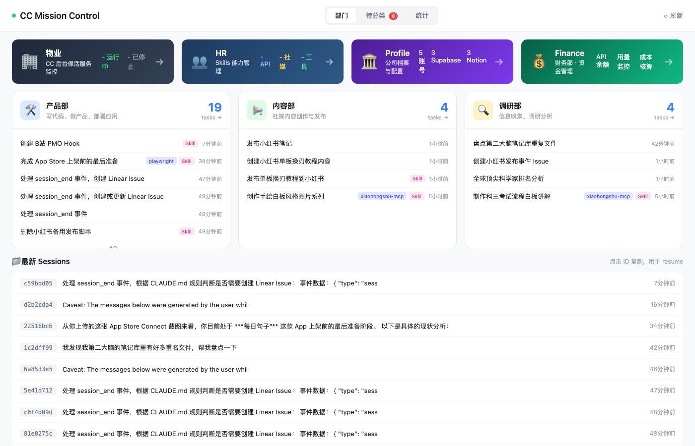

# Personal AI Company

> **它现在能做什么？** 写代码并一键部署到 App Store 和 Web；用 AI 画图、做视频、合成数字人；一键发布到小红书/B站/X/YouTube；多源并发深度调研出报告；追踪投资持仓做交易复盘；语音合成与识别；浏览器自动化采集——60+ 个 Skills，自然语言触发，7x24 待命。

你可曾思考过一个问题，如果强迫让你每天消耗 1 亿 token，你能花完吗？

如果没有头绪，就来开一家 AI 公司吧！

**一家全员 AI 的公司，你是唯一的人类——CEO**

---

## 一、这家公司的唯一目的是为你赚钱

如纳瓦尔所说三种杠杆，加上信息杠杆：

| 事业部 | 杠杆类型 | 职责 |
|--------|----------|------|
| **Product BU** | 代码杠杆 | 将 idea 变为产品，找到 1000 个愿意付费的用户 |
| **Content BU** | 媒体杠杆 | 将灵感变为社媒内容，提高互联网影响力 |
| **Research BU** | 信息杠杆 | 深度调研，将信息不对称变为决策优势 |
| **Investment BU** | 资本杠杆 | 管理投资，事件驱动，放大资金 |


## 二、公司组织架构

```
┌──────────────────────────────────────────────────────────────┐
│                  YOUR PERSONAL AI COMPANY                    │
├──────────────────────────────────────────────────────────────┤
│                                                              │
│  👤 CEO (你，人类)                                            │
│   │                                                          │
│   ├─→ 🏢 PMO (项目管理办公室)                                  │
│   │    └─→ 全局追踪：自动记录各 BU 产出到 Linear              │
│   │                                                          │
│   ├─→ 📦 Product BU (产品事业部)                              │
│   │    └─→ 代码杠杆：Viva, VoiceType, ModelHop...            │
│   │                                                          │
│   ├─→ 📢 Content BU (内容事业部)                              │
│   │    └─→ 媒体杠杆：小红书、X、B站、YouTube                   │
│   │                                                          │
│   ├─→ 🔬 Research BU (调研部门)                               │
│   │    └─→ 信息杠杆：多源调研、竞品分析、舆情追踪              │
│   │                                                          │
│   └─→ 💰 Investment BU (投资事业部)                           │
│        └─→ 资本杠杆：持仓分析、交易复盘                        │
│                                                              │
│     全员 AI，7×24 在线，永不请假，随叫随到                     │
│                                                              │
└──────────────────────────────────────────────────────────────┘
```

### 你的工作方式变了

| 传统模式 | AI 公司模式 |
|---------|------------|
| 自己写推文 | 下达指令："发一条关于 AI 趋势的推" |
| 自己做调研 | 下达指令："调研一下 AI 视频赛道" |
| 自己剪视频 | 下达指令："把这个素材做成短视频" |
| 自己追踪线索 | 下达指令："扒一扒这个事件" |
| 自己开发产品 | 下达指令："做一个 AI 行程助手的产品" |
| 凡事亲力亲为 | **只做决策，执行交给 AI** |

---

## CC Mission Control

> CEO 的实时看板，一眼掌握全公司运转状态



自动从 Claude Code Sessions 中提取任务，按部门分类展示。包含后台服务监控、Skills 管理、成本追踪等模块。

---

## 三、PMO：公司管理中枢

> PMO (Project Management Office) 是 CEO 的眼睛，自动追踪各事业部产出

### 3.1 设计理念

**飞轮**：知识 → 产品 → 影响力 → 资本 → 更多知识

**三大杠杆协同**：
- 产品产出 → 内容素材（技术博客、产品故事）
- 内容影响力 → 产品用户
- 投资收益 → 支撑产品/内容投入

### 3.2 自动化追踪

PMO 通过 Claude Code Hooks 自动捕捉各 BU 的关键事件：

| 事业部 | 追踪事件 | Hook |
|--------|----------|------|
| 产品 | Git 分支创建 | `pmo-report-git.js` |
| 产品 | TestFlight 部署 | `pmo-report-testflight.js` |
| 产品 | Web 部署 | `pmo-report-vercel.js` |
| 内容 | 小红书发布 | `pmo-report-xhs.js` |
| 内容 | B站发布 | `pmo-report-bilibili.js` |
| 内容 | X 发布 | `pmo-report-x.js` |
| 投资 | 交易执行 | `pmo-report-trade.js` |
| 投资 | 深度调研 | `pmo-report-research.js` |

### 3.3 PMO Agent 动态决策

Hook 检测到事件后，调用 PMO Agent 处理：

```
Hook 检测到事件
    ↓
调用 PMO Agent (claude --cwd pmo/)
    ↓
Agent 读取 CLAUDE.md + BU 规则
    ↓
查询 Linear 现有 Issue
    ↓
决策：新建 / 更新 / 关联
    ↓
执行 Linear API
```

**智能判断**：
- 同 Session 的多次产出自动归到同一 Issue
- 根据关键词自动匹配 Project
- 根据内容自动打 Label

### 3.4 规则配置

```
pmo/
├── CLAUDE.md              # PMO Agent prompt
├── rules/
│   ├── product-bu.md      # 产品事业部规则
│   ├── content-bu.md      # 内容事业部规则
│   ├── research-bu.md     # 调研部门规则
│   └── investment-bu.md   # 投资事业部规则
```

规则修改即生效，无需改代码。

---

## 四、四大事业部

### 4.1 Product BU (产品事业部)

> 代码杠杆：将 idea 变为产品

**核心能力**：
- `deploy` - 统一部署（Vercel/Cloudflare/TestFlight）
- `chat-to-supabase` - 数据库操作
- `/tdd` `/build-fix` `/code-review` - 开发流程

**当前产品**：
| 产品 | 状态 | 说明 |
|------|------|------|
| Viva | WIP | 英语学习 App |
| VoiceType | WIP | 语音输入 |
| ModelHop | Published | 模型切换 |

### 4.2 Content BU (内容事业部)

> 媒体杠杆：将灵感变为社媒内容

**核心能力**：
- `api-draw` - AI 生图 + 图片处理
- `video` - 视频制作与处理
- `social-media` - 统一发布入口
- `xiaohongshu` `x-post` `biliup-publish` - 各平台发布

**内容系列**：
| 系列 | 平台 | 说明 |
|------|------|------|
| n张图系列 | 小红书 | 图文科普 |
| 人物语录系列 | 小红书 | 名人名言配图 |
| 技术科普系列 | B站/小红书 | 编程/AI 科普 |

### 4.3 Research BU (调研部门)

> 信息杠杆：深度调研，将信息不对称变为决策优势

**核心能力**：
- `research` - 多信息源并发深度调研
- `research-by-reddit` - Reddit 专题调研
- `browse-use` `playwright-cli` - 浏览器自动化采集
- `api-pdf2markdown` - PDF/文档解析
- `concept-tree` - 知识结构生成
- `notebooklm` - NotebookLM 文档问答

**调研类型**：
| 类型 | 说明 |
|------|------|
| 技术调研 | 框架选型、方案评估、能力评测 |
| 市场调研 | 用户痛点、竞品分析、市场规模 |
| 投资调研 | 行业研究、公司分析、财报解读 |
| 舆情分析 | 社交媒体情绪、热点追踪 |
| 人物/公司 | 背景调查、深度扒析 |

### 4.4 Investment BU (投资事业部)

> 资本杠杆：管理投资，放大资金

**核心能力**：
- `futu-trades` - 富途交易记录、持仓查询
- `research` - 深度调研（Reddit/Twitter/Perplexity）
- `KOL-info-collect` - 投资群情报收集
- `lakehouse` - 本地数据分析

**核心任务**：
| 任务 | 频率 | 说明 |
|------|------|------|
| 持仓检视 | 每周 | 检查持仓健康度 |
| 事件追踪 | 实时 | 重大事件的投资影响 |
| 行业调研 | 按需 | 新赛道、新标的研究 |

---

## 五、公司目录结构

```
~/usr/pac/                         # Personal AI Company
├── pmo/                           # 项目管理办公室
│   ├── CLAUDE.md                  # PMO Agent 配置
│   ├── rules/                     # 各 BU 规则
│   │   ├── product-bu.md
│   │   ├── content-bu.md
│   │   ├── research-bu.md
│   │   └── investment-bu.md
│   └── lib/handler.js             # 备用硬编码逻辑
├── product-bu/                    # 产品事业部
│   ├── .claude/CLAUDE.md
│   ├── hooks/                     # PMO 上报 hooks
│   │   ├── pmo-report-git.js
│   │   ├── pmo-report-testflight.js
│   │   └── pmo-report-vercel.js
│   └── inbox/
├── content-bu/                    # 内容事业部
│   ├── .claude/CLAUDE.md
│   ├── hooks/
│   │   ├── pmo-report-xhs.js
│   │   ├── pmo-report-bilibili.js
│   │   └── pmo-report-x.js
│   └── inbox/
├── research-bu/                   # 调研部门
│   ├── .claude/CLAUDE.md
│   └── inbox/
├── investment-bu/                 # 投资事业部
│   ├── .claude/CLAUDE.md
│   ├── hooks/
│   │   ├── pmo-report-trade.js
│   │   └── pmo-report-research.js
│   └── inbox/
├── infrastructure/                # 基础设施（本地 Supabase/Redis）
└── archive/                       # 归档
```

---

## 六、如何使用

### 6.1 进入事业部

```bash
# 产品事业部
cd ~/usr/pac/product-bu && claude --dangerously-skip-permissions

# 内容事业部
cd ~/usr/pac/content-bu && claude --dangerously-skip-permissions

# 调研部门
cd ~/usr/pac/research-bu && claude --dangerously-skip-permissions

# 投资事业部
cd ~/usr/pac/investment-bu && claude --dangerously-skip-permissions

# 公司总部（通用）
cd ~/usr/pac && claude --dangerously-skip-permissions
```

### 6.2 CEO 指令示例

**产品事业部**：
```
做一个 AI 写作助手
给 Viva 加个功能：支持导出学习记录
发布到 TestFlight
```

**内容事业部**：
```
发条推，讲讲 AI 改变工作方式
做一条小红书，讲 Claude Code 的 5 个技巧
把这个视频洗稿发小红书 https://...
```

**调研部门**：
```
调研一下 AI 视频赛道
扒一扒这个公司的背景
帮我做个 Remotion vs Motion Canvas 的技术选型
```

**投资事业部**：
```
查看我的持仓
分析一下我持仓的 NVDA
最近投资群在聊什么
```

---

## 七、基础设施

| 你需要准备的 | 公司类比 | 作用 |
|-------------|---------|------|
| **Mac 电脑** | 办公大楼 | 公司 7×24 运转的物理载体 |
| **[Claude Code Max](https://claude.ai/download)** | 校招预算 | 雇佣 AI 员工的薪资（$100/月或$200/月） |
| **[Linear](https://linear.app/)** | OA 系统 | 项目管理、Issue 追踪 |
| **[Supabase](https://supabase.com/)** | 后端团队 | 数据库、认证、存储 |
| **[OpenRouter](https://openrouter.ai/)** | 外脑顾问团 | 按需调用多模型 |
| **各平台 API** | 各渠道 | X、小红书、B站、富途等 |

---

## 八、设计理念

### 8.1 项目级配置隔离

每个事业部有独立的 `.claude/CLAUDE.md`，进入不同目录自动加载对应配置：
- 产品事业部：开发相关 skills + 部署能力
- 内容事业部：画图、视频、发布能力
- 调研部门：多源搜索、浏览器采集、知识结构化能力
- 投资事业部：交易追踪、情报收集、数据分析能力

### 8.2 Skills 分层

```
全局 Skills (所有事业部可用)
├── api-fetch (搜索抓取)
├── api-openrouter (多模型)
├── api-notify (通知)
└── explain (概念解释)

事业部专属 Skills
├── Product: deploy, chat-to-supabase, learn-english
├── Content: api-draw, video, social-media, xiaohongshu
├── Research: research, browse-use, concept-tree, notebooklm
└── Investment: futu-trades, KOL-info-collect, lakehouse
```

### 8.3 PMO 管理原则

1. **轻量自动化**：不打断工作流，后台静默记录
2. **数据驱动**：所有决策可追溯，所有产出可量化
3. **CEO 视角**：PMO 服务于 CEO 的全局把控，不是流程负担
4. **智能决策**：Agent 理解上下文，动态判断最佳行动

---

## 许可证

MIT License

---

**每个人都可以拥有一家公司，全员 AI，只有老板是人。**

**你负责想，AI 负责做。**
