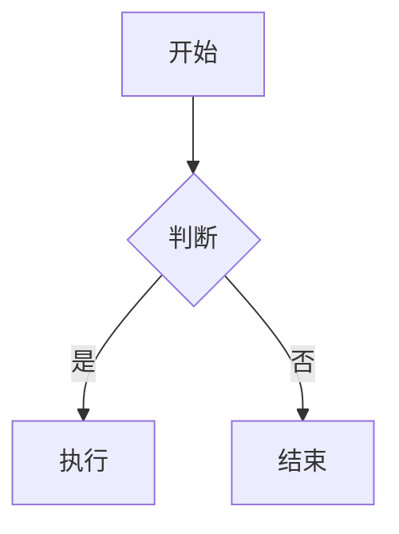

# Obsidian Markdown 语法规范

本 skill 定义 Obsidian 特有的 Markdown 语法规则。当编辑 `.md` 文件（尤其是 Obsidian vault 中的文件）时，**必须严格遵循**这些规则。

---

## 核心原则

1. **保留现有格式** - 编辑文件时，保持原有的 Obsidian 语法不变
2. **使用正确语法** - 新增内容必须符合 Obsidian 语法
3. **链接完整性** - 绝不破坏 wikilinks 和 embeds

---

## 1. Wikilinks（双链）

Obsidian 使用 `[[]]` 语法创建内部链接，**不要**转换为标准 Markdown 链接。

### 基础语法

```markdown
# ✅ 正确
[[笔记名称]]
[[文件夹/笔记名称]]
[[笔记名称|显示文本]]
[[笔记名称#标题]]
[[笔记名称#^block-id]]

# ❌ 错误 - 不要转换为标准链接
[笔记名称](笔记名称.md)
[显示文本](笔记名称.md)
```

### 链接变体

| 语法 | 说明 | 示例 |
|------|------|------|
| `[[note]]` | 基础链接 | `[[每日笔记]]` |
| `[[note\|alias]]` | 别名显示 | `[[Spaced Repetition\|间隔重复]]` |
| `[[note#heading]]` | 链接到标题 | `[[项目计划#下一步行动]]` |
| `[[note#^block-id]]` | 链接到块 | `[[会议记录#^meeting-001]]` |
| `[[#heading]]` | 当前文件标题 | `[[#参考资料]]` |

---

## 2. Embeds（嵌入）

使用 `![[]]` 嵌入其他内容。

```markdown
# ✅ 正确
![[图片.png]]
![[笔记名称]]
![[笔记名称#章节]]
![[文档.pdf]]
![[音频.mp3]]

# ❌ 错误
           # 标准 Markdown 图片语法
[笔记名称](笔记名称.md)      # 普通链接无法嵌入
```

### 图片尺寸控制

```markdown
![[image.png|300]]          # 宽度 300px
![[image.png|300x200]]      # 300x200px
![[image.png|100%]]         # 100% 宽度
```

---

## 3. Callouts（高亮块）

Obsidian 使用特殊的 blockquote 语法创建 callouts。

### 基础语法

```markdown
> [!note]
> 这是一个笔记 callout

> [!warning]
> 这是一个警告

> [!tip] 自定义标题
> 带自定义标题的提示
```

### 可折叠 Callout

```markdown
> [!faq]- 点击展开
> 折叠的内容

> [!info]+ 默认展开
> 但可以折叠
```

### 常用 Callout 类型

| 类型 | 别名 | 用途 |
|------|------|------|
| `note` | | 一般笔记 |
| `tip` | `hint`, `important` | 提示 |
| `warning` | `caution`, `attention` | 警告 |
| `danger` | `error` | 危险/错误 |
| `info` | | 信息 |
| `todo` | | 待办 |
| `quote` | `cite` | 引用 |
| `example` | | 示例 |
| `question` | `help`, `faq` | 问题 |
| `success` | `check`, `done` | 成功 |
| `failure` | `fail`, `missing` | 失败 |
| `bug` | | Bug |
| `abstract` | `summary`, `tldr` | 摘要 |

### 嵌套 Callout

```markdown
> [!question] 问题
> 外层问题
> > [!answer] 答案
> > 嵌套的答案
```

---

## 4. Block References（块引用）

### 创建块 ID

```markdown
这是一段重要的文字 ^important-block

- 列表项 1
- 列表项 2 ^list-block
```

### 引用块

```markdown
[[笔记#^important-block]]
![[笔记#^important-block]]    # 嵌入块内容
```

---

## 5. Tags（标签）

```markdown
# ✅ 正确
#标签
#嵌套/标签
#tag/subtag/subsubtag

# ❌ 错误
# 标签          # 空格会变成标题
#123           # 纯数字无效
```

---

## 6. Frontmatter（YAML 头）

必须位于文件最开头，用 `---` 包裹。

```yaml
---
uid: 550e8400-e29b-41d4-a716-446655440000
title: 笔记标题
tags:
  - tag1
  - tag2
aliases:
  - 别名1
  - 别名2
date: 2026-01-21
cssclass: custom-class
---
```

### 常用字段

| 字段 | 说明 |
|------|------|
| `uid` | 唯一标识符 |
| `title` | 标题 |
| `tags` | 标签数组 |
| `aliases` | 别名（用于搜索和链接） |
| `date` | 日期 |
| `cssclass` | 自定义 CSS 类 |
| `publish` | 是否发布 |

---

## 7. 特殊语法

### 高亮文本

```markdown
==高亮文本==
```

### 注释

```markdown
%%这是注释，不会渲染%%

%%
多行注释
也是可以的
%%
```

### 数学公式

```markdown
行内公式：$E = mc^2$

块级公式：
$$
\sum_{i=1}^{n} x_i = x_1 + x_2 + \cdots + x_n
$$
```

### Mermaid 图表

````markdown

````

---

## 8. 任务/待办

```markdown
- [ ] 未完成任务
- [x] 已完成任务
- [/] 进行中（部分插件支持）
- [-] 已取消（部分插件支持）
```

---

## 9. 表格

标准 Markdown 表格语法，但注意：

```markdown
| 列1 | 列2 | 列3 |
|:----|:---:|----:|
| 左对齐 | 居中 | 右对齐 |
| [[链接]] | ==高亮== | `代码` |
```

表格内可以使用 wikilinks、高亮等 Obsidian 语法。

---

## 10. 常见错误及修正

### ❌ 破坏 Wikilink

```markdown
# 错误：把 wikilink 转成标准链接
[笔记](笔记.md)

# 正确：保持 wikilink
[[笔记]]
```

### ❌ Callout 格式错误

```markdown
# 错误：缺少空格或格式不对
>[!note]
>内容

# 正确：注意空格
> [!note]
> 内容
```

### ❌ 块 ID 格式错误

```markdown
# 错误：块 ID 有空格
^block id

# 正确：使用连字符
^block-id
```

### ❌ Frontmatter 位置错误

```markdown
# 错误：frontmatter 不在文件开头

一些文字
---
title: 笔记
---

# 正确：必须在文件最开头
---
title: 笔记
---

一些文字
```

---

## 使用场景

当你处理以下路径的文件时，自动应用本规范：

- `~/usr/projects/odyssey/**/*.md`
- 任何 Obsidian vault 目录下的 `.md` 文件
- 用户明确要求使用 Obsidian 格式时

---

## 快速检查清单

编辑 Obsidian 文件前，确认：

- [ ] 保留所有 `[[wikilinks]]`
- [ ] 保留所有 `![[embeds]]`
- [ ] Callout 格式正确 `> [!type]`
- [ ] Frontmatter 在文件开头
- [ ] 块 ID 格式正确 `^block-id`
- [ ] 高亮使用 `==text==`
- [ ] 注释使用 `%%comment%%`
